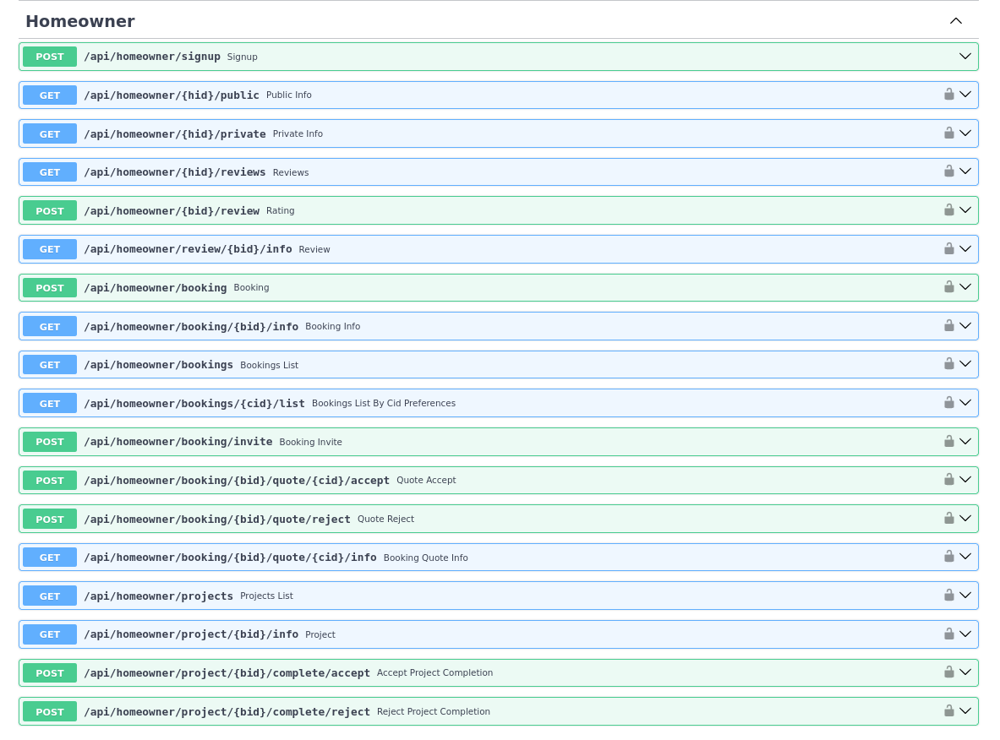
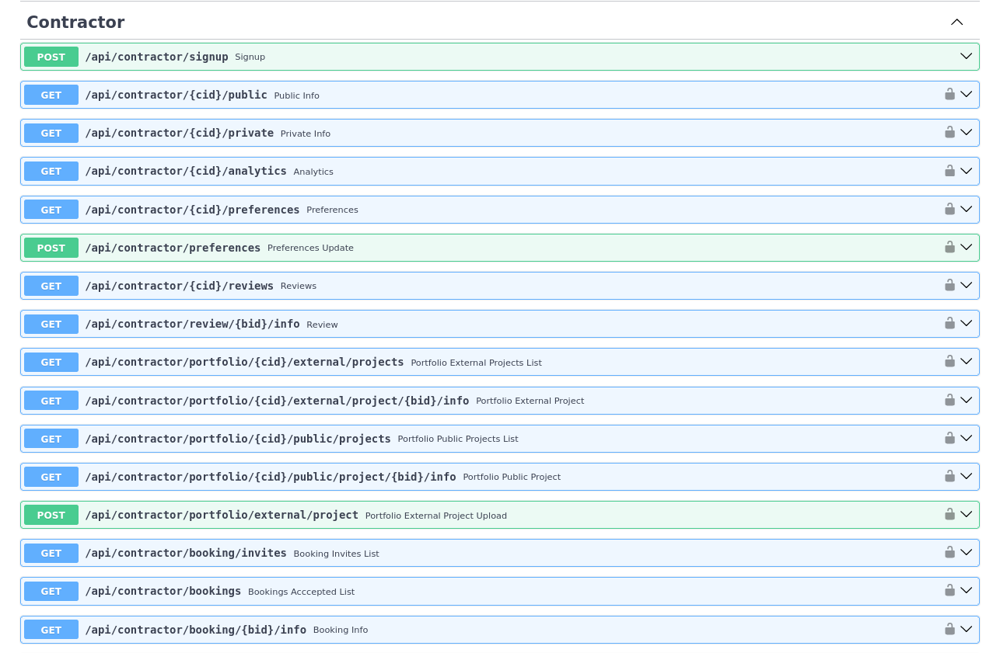
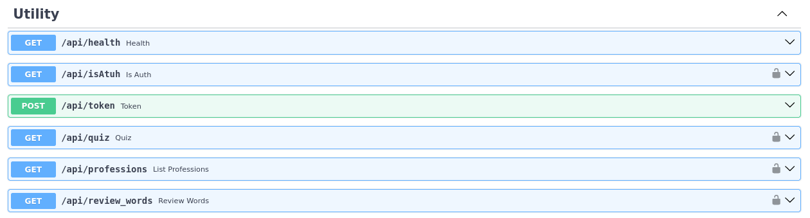
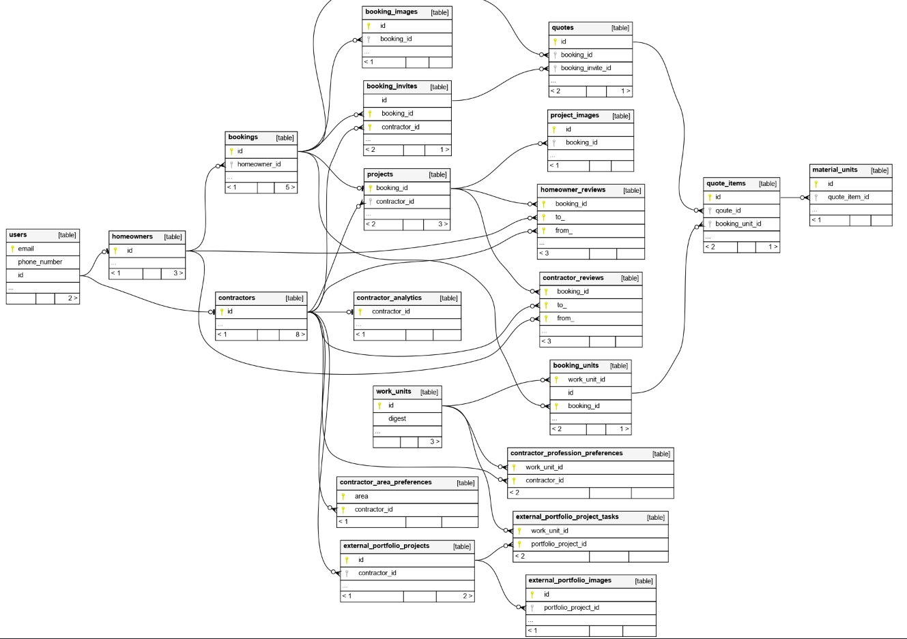

# SiteSync Backend API

Python/FastAPI backend powering a project booking and tracking platform, connecting general contractos and homeowners.

## Dependencies

- Web Framework [FastAPI](https://fastapi.tiangolo.com/)
- ORM and data validation [SQLModel](https://docs.pydantic.dev/latest/)
  - [SQL Alchemy](https://www.sqlalchemy.org/)
  - [Pydantic](https://docs.pydantic.dev/latest/)
- Terminal-based front-end to PostgreSQL [psql](https://www.postgresql.org/docs/current/app-psql.html)
- Migrations [Alembic](https://alembic.sqlalchemy.org/en/latest/)

## How to run?

You can run the application using the docker compose.
Note: execute `poetry update` after pull

- copy `.env.example` to `.env`
  - `ENV=dev` creates database tables from models
  - `ENV=prod` executes alembic migrations
- `docker compose up --build`
- `psql -h localhost -U postgres -d sitesync`
  - connects to the postgres instance inside of the docker container (password is "password")
Note: supports hot-reloading

## How to test?

Run tests from `test/`

- copy `.env.example` to `.env`
- `.scrips/test_runner.sh` run all tests
  - `.scrips/test_runner.sh ./test/file` run all tests in file
  - `.scrips/test_runner.sh ./test/file test_name` run test_name in file

Extras

- API docs at `localhost:8881/docs`
- Interative browser based database documentation open `docs/db/index.html`

## Swagger API Docs

## DB Schema

## Installation

- Install [Pyenv](https://github.com/pyenv/pyenv) (Python Version Manager)
- `.python-version` contains the target python version
- Install [Poetry](https://python-poetry.org/docs/) (Virtual Env Manager)
  - `pyproject.toml` - list of dependacies and project configuration
  - `poetry install`
- Install [psql](https://www.postgresql.org/docs/current/app-psql.html)
- Install [Docker](https://www.docker.com/)
- Enjoy

## MISC

- In vscode "Python: Select Interpreter" and select the venv created by poetry
- `poetry shell` drop into virt env shell
- `poertry add X` install packages by locking
- `openssl rand -hex 32` generate random key to sign JTWs
- `pipenv run alembic revision -m "revision title"` create revisions
